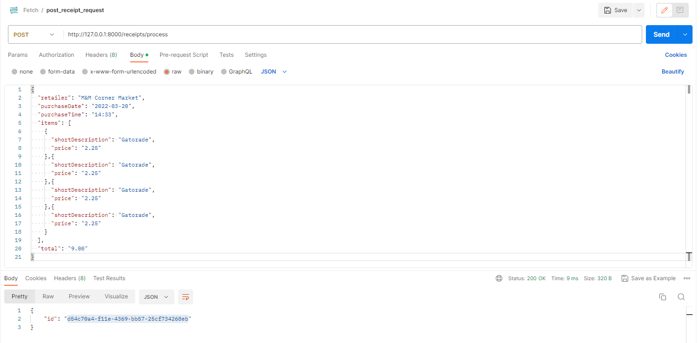
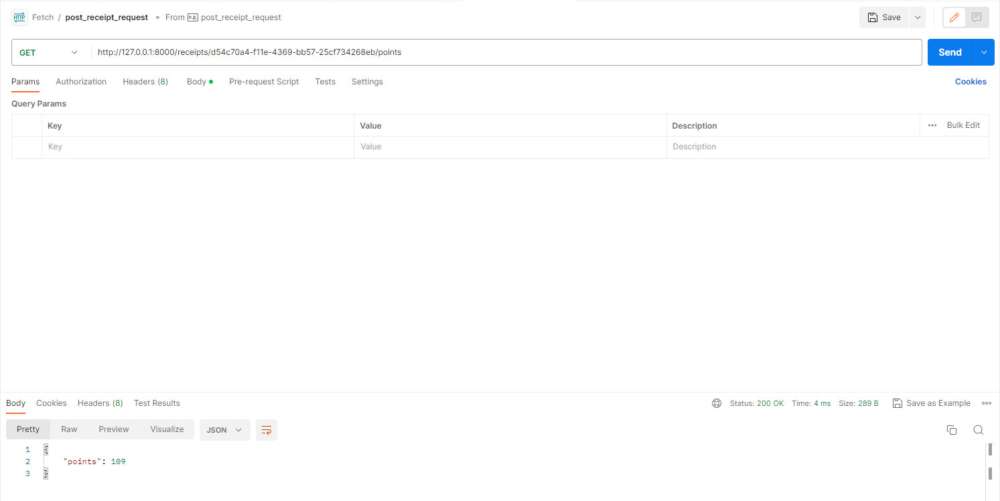

# Fetch_Challenge
Receipt Processor Challenge

The webservice is created using Python and Django. 

# INSTRUCTIONS TO RUN THE SERVICE

1. Clone the repository to your local machine.

2. At the root of the working directory run the following docker commands to have the service up and running:

    ```bash

    docker build --tag python-django .

    docker run --publish 8000:8000 python-django

Additional Information:

1. The code for the endpoints can be found in the receipts application: "receipts/views.py"

2. The test cases for the endpoints can be found in the receipts application: "receipts/tests.py"
   Test cases covered: 
    * Test for processing receipts with a valid payload (Returns 200 status code and response contains an id).
    * Test for processing receipts with invalid payload (Returns 400 status code).
    * Test to get points when the receipt is found (Returns 200 status code and response contains the points).
    * Test for getting points when the receipt is not found (Return 404 status code).
    * Test for testing the function that calculates the points (Returns the correct points earned).

3. Can use Postman or any other service to test the below endpoints.
    "http://127.0.0.1:8000/receipts/process"
    "http://127.0.0.1:8000/receipts/<id>/points"

4. Below are the screenshots for the POST and GET requests made to the service using Postman.

    
    